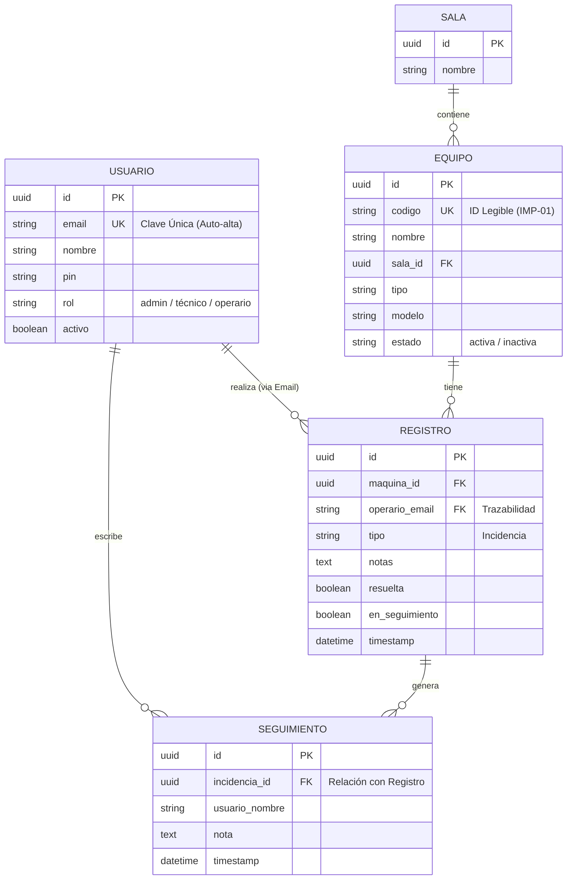

## 📝 Notas Técnicas

### Autenticación
- Supabase Auth maneja sesiones con JWT
- `localStorage` almacena:
  - `sgi_user_session` - Sesión de usuario normal
  - `sgi_admin_session` - Sesión de admin/técnico

### Flujo de Incidencias
1. Operario escanea QR → `/operario.html?machine=ID`
2. Selecciona tipo de incidencia y añade notas
3. El registro se guarda en `registros`
4. Admin ve la incidencia en `/dashboard.html`
5. Puede marcar como "resuelta" o "en seguimiento"

### Estados de Máquina
- **OPERATIVA** (verde) - Funcionando correctamente
- **CON INCIDENCIA** (rojo) - Tiene incidencia sin resolver
- **EN SEGUIMIENTO** (naranja) - Incidencia en seguimiento
- **INACTIVA** (gris) - Fuera de servicio

---

## 🗄️ Modelo Entidad-Relación (ER)

Este modelo define la estructura de datos optimizada para la trazabilidad y el seguimiento de incidencias.

---

## 🎛️ Panel de Administración (`/dashboard.html`)

El panel de administración está organizado en 5 secciones principales, accesibles desde la barra lateral:

### 1. 📊 Resumen (Dashboard)
Vista general del estado del sistema con KPIs en tiempo real.

| Elemento | Descripción |
|----------|-------------|
| **Tarjeta Incidencias** | Muestra: Sin resolver / En seguimiento. Botón para ir al panel de incidencias |
| **Tarjeta Máquinas** | Muestra: Activas / Inactivas. Botón para ver máquinas |
| **Tabla Incidencias sin resolver** | Lista de incidencias pendientes con máquina, sala, operario y fecha |
| **Panel Máquinas inactivas** | Lista de máquinas fuera de servicio actualmente |

### 2. 🖨️ Máquinas y Salas
Gestión completa del parque de máquinas y sus ubicaciones.

| Elemento | Descripción |
|----------|-------------|
| **Buscador** | Filtra máquinas por nombre o código |
| **Filtro por Sala** | Dropdown para ver máquinas de una sala específica |
| **Botón "Salas"** | Abre modal para gestionar salas (crear, editar, eliminar) |
| **Botón "+ Nueva máquina"** | Abre formulario para añadir máquina (solo admin) |
| **Grid de Máquinas** | Tarjetas visuales de cada máquina con estado, sala, modelo y dimensiones |
| **Tarjeta de máquina** | Muestra: nombre, estado (color), sala, modelo, dimensiones, frecuencia de mantenimiento |

### 3. ⚠️ Incidencias
Gestión de tickets de incidencias con filtros y estadísticas.

| Elemento | Descripción |
|----------|-------------|
| **Filtros rápidos** | Todas / Sin resolver / En seguimiento / Resueltas |
| **Selector de orden** | Fecha (reciente/antigua) / Por máquina |
| **Filtros de fecha** | Desde / Hasta para rango de fechas |
| **Botón "Exportar CSV"** | Descarga listado de incidencias en CSV |
| **KPI Sin resolver** | Contador de incidencias sin resolver (rojo) |
| **KPI En Seguimiento** | Contador de incidencias en seguimiento (amarillo) |
| **KPI Resueltas** | Contador de incidencias resueltas (verde) |
| **Grid de Tickets** | Tarjetas de incidencias con info completa y acciones |
| **Ticket de incidencia** | Muestra: máquina, tipo, notas, operario, fecha, estado, fotos, botones resolver/seguimiento |

### 4. 👥 Usuarios del Sistema
Gestión de accesos y roles (solo administradores).

| Elemento | Descripción |
|----------|-------------|
| **Botón "Roles"** | Muestra popover explicando: Usuario / Técnico / Administrador |
| **Botón "Actualizar"** | Recarga la lista de usuarios |
| **Info del sistema** | Explica el flujo de registro y activación de usuarios |
| **Filtros por rol** | Todos / Administradores / Técnicos / Usuarios |
| **Tabla de usuarios** | Nombre/Email, Rol, Estado, Registro, Acciones |
| **Acciones por usuario** | Cambiar rol, activar/desactivar cuenta |

### 5. 🔳 Códigos QR
Generación e impresión de QR para operarios.

| Elemento | Descripción |
|----------|-------------|
| **Buscador** | Buscar máquina por nombre |
| **Filtro por Sala** | Filtrar QRs por ubicación |
| **Botón "Imprimir Todos los QRs"** | Genera PDF con todos los códigos QR |
| **Info QR** | Explicación de cómo usar los códigos QR |
| **Grid de QR** | Tarjetas con QR de cada máquina |
| **Tarjeta QR** | Código QR escaneable, nombre de máquina, sala, botón imprimir individual |

### Elementos Comunes del Panel

| Elemento | Ubicación | Función |
|----------|-----------|---------|
| **Barra lateral** | Izquierda | Navegación entre secciones + info de versión |
| **Topbar** | Superior | Título de sección, subtítulo, botón tema, botón guía, menú cuenta |
| **Menú móvil** | Topbar (☰) | Toggle de sidebar en dispositivos móviles |
| **Botón Tema** | Topbar | Cambiar entre tema claro/oscuro |
| **Botón Guía Rápida** | Topbar | Inicia tour interactivo de la sección actual |
| **Badge de incidencias** | Sidebar (nav) | Contador de incidencias sin resolver |

---

## 📋 Modelo Relacional (Resumen)

| Entidad | Campos principales |
|---------|-------------------|
| **USUARIOS** | `id` PK, `email` UK, `nombre`, `pin`, `rol`, `activo` |
| **SALAS** | `id` PK, `nombre` |
| **EQUIPOS** | `id` PK, `nombre`, `sala_id` FK, `tipo`, `modelo`, `estado` |
| **REGISTROS** | `id` PK, `maquina_id` FK, `tipo`, `notas`, `resuelta`, `en_seguimiento` |
| **SEGUIMIENTOS** | `id` PK, `incidencia_id` FK, `nota`, `timestamp` |

---

*Documentación actualizada: Mayo 2026*
